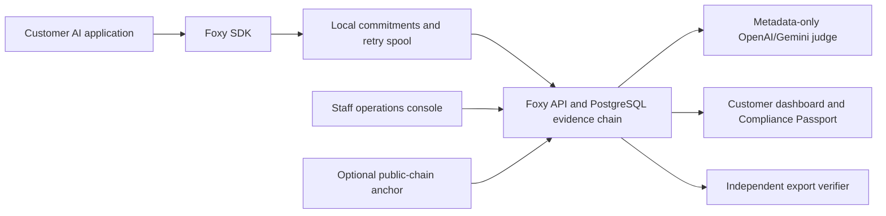

# Foxy Audit

> Content-blind evidence for AI systems that need to earn trust.

Foxy Audit helps teams operating AI in healthcare, finance, legal, and other
regulated environments produce verifiable evidence without centralizing raw
prompts and responses. The SDK creates customer-owned commitments on the
developer's machine, sends only bounded metadata, and writes a sequential,
tamper-evident audit chain. The customer can export and verify that evidence
independently.

This is an evidence and integrity layer. It also offers an optional host-side
policy guard that can block or redact a prompt locally, before the SDK-wrapped
model call runs (see [Host-Side Policy Enforcement](#host-side-policy-enforcement-preflight-guard)).
It is not a legal certification, not a comprehensive network firewall, and not
proof of complete capture when an AI call bypasses the SDK.

## Why It Exists

AI vendors are often asked to prove that an audit record was not changed and
that sensitive conversations were not copied into a monitoring vendor's store.
Ordinary application logs are mutable, while a full-content monitoring design
increases privacy and data-retention risk. Foxy separates the two concerns:

- the host keeps the raw conversation;
- Foxy receives commitments, token counts, policy tags, bounded identifiers,
  and locally detected signals;
- the backend links records into an ordered chain;
- the verifier detects a changed, removed, or reordered historical record.

The result is a lower-data audit trail that a buyer, auditor, or security team
can inspect without trusting a dashboard screenshot.

## Product Surfaces

```text
Customer AI app
    |  @foxy.audit decorator
    v
Python SDK -> local SQLite/WAL spool -> FastAPI -> PostgreSQL chain
                                      |
                                      +-> worker: Gemini and/or OpenAI metadata judge
                                      +-> deterministic metadata policy fallback
                                      +-> customer dashboard and desktop companion
                                      +-> export and independent verifier

Staff/admin console -> tenant-scoped operations, alerts, grading, anchors, billing
Sales site           -> product explanation and onboarding
```



Raw prompts and responses do not leave the customer process through this path.

- **SDK:** one decorator, local keyed commitments, durable retry spool, sync,
  async, and generator support.
- **Backend:** tenant-isolated ingestion, ordered chain, usage, policies,
  grading queue, exports, and optional public-chain anchoring.
- **Customer dashboard:** ledger, verification, passport/export, team access,
  API keys, billing, notifications, and breach review.
- **Desktop companion:** local visual feedback and a dashboard shortcut.
- **Verifier:** standard-library verification of exports and known events.
- **Admin console:** staff operations and customer/account monitoring.

## Host-Side Policy Enforcement (Preflight Guard)

By default the SDK observes: it runs the wrapped model call and then records
content-blind evidence. Two optional modes let the SDK act *before* the prompt
leaves the host:

```python
@foxy.audit(policy="hipaa", mode="block")    # or mode="redact"
def call_model(prompt: str) -> str:
    return customer_llm.generate(prompt)
```

- `mode="observe"` (default) — unchanged behavior; run, then hash.
- `mode="block"` — evaluate the prompt locally first. If it matches the active
  policy (PHI/PII under `hipaa`/`gdpr`; prompt-injection and secrets/keys
  otherwise), the wrapped function is **never called**, a `FoxyPolicyBlocked`
  exception is raised, and a content-blind `blocked` event is recorded.
- `mode="redact"` — offending spans are masked locally and the wrapped function
  receives the redacted prompt; a `redacted` event is recorded.

Detection is local and pattern-based (regex plus optional Presidio NLP): a
best-effort guard for SDK-wrapped calls, not a guarantee that every sensitive
value is caught, and not a network-level firewall. Enforcement events carry only
hashes and signal labels — the raw offending text is never transmitted. A
blocked prompt is *prevented egress*: it is recorded as evidence and is never
counted as a model breach.

## Capture Coverage: The Evidence Boundary

Tamper evidence is only useful when a buyer can also see the boundary of what
was observed. Foxy records an SDK-local `client_id` and monotonic `client_seq`
inside each chained event, then exposes a content-blind coverage report at
`GET /v1/coverage`. It reports:

- contiguous client sequences that reached Foxy;
- missing client-sequence ranges and duplicate sequence reuse;
- events captured without a complete client identity;
- whether the server-side hash chain currently verifies.

This is deliberately stronger than a green dashboard badge and deliberately
more honest than a claim of total capture. The report covers SDK-reported
events only; it cannot see a model call made outside the SDK. That limitation
is visible to the customer, auditor, and reviewer instead of being hidden.

## Fastest Judge Test: No LLM Required

This path needs Python 3.9+ only. It uses synthetic sample events to exercise
the real verifier and cryptographic chain logic. It does not pretend to be a
live model call and does not contact Foxy servers.

```powershell
python demo/offline_demo.py
```

Expected checks are:

```text
[PASS] chain verified: 3 rows
[PASS] customer commitments verified: 3
[PASS] offline receipt matches chain head
[PASS] tamper detected at sequence 2
```

Use this first when no API key, database, or LLM is available.

To explore the host-side preflight guard interactively without any LLM, use the
mock-model sandbox:

```powershell
python demo/mock_llm.py --scenario phi     # blocked before the mock model runs
python demo/mock_llm.py                     # interactive: type prompts, see the decision
```

## Real Client-Style Test

The real path uses the SDK, backend, database, queue worker, and customer API.
The demo function is only a local stand-in for the customer's existing model
call; the Foxy capture, chain, policy grading, and API behavior are real.

1. Start PostgreSQL and the backend as described in [backend/README.md](backend/README.md).
2. Seed an organization and keep the printed `FOXY_API_KEY` private.
3. Install and run the SDK demo:

```powershell
pip install -e .\sdk
$env:FOXY_API_KEY = "foxy_sk_your_key"
$env:FOXY_BACKEND_URL = "http://127.0.0.1:8000"
python demo/run_demo.py
```

4. Open the customer dashboard and check the ledger, grading state, and chain
   verification. The anomalous synthetic event exceeds the configured metadata
   threshold and can be flagged without any LLM.
5. For a real customer integration, replace the body of the decorated function
   with the customer's existing OpenAI, Anthropic, Gemini, or private-model
   call. No Foxy-specific model wrapper is required.

## Live GPT-5.6 Client and Judge Demo

This is the full judge-facing path: a real OpenAI Responses API call, a durable
Foxy SDK receipt, a real queued metadata verdict, and server-side chain
verification. It is intentionally separate from the offline demo. Use safe,
non-sensitive demo content because the selected model provider receives the
prompt; Foxy still receives commitments and bounded metadata only.

```powershell
# Terminal 1: start the local backend, database, and worker.
cd backend
$env:OPENAI_API_KEY = "your_openai_key"
$env:OPENAI_MODEL = "gpt-5.6"
docker compose up --build -d

# On a fresh database, copy FOXY_API_KEY from this one-shot seed service.
docker compose logs foxy-seed

# Terminal 2: run the customer's real GPT-5.6-style call through Foxy.
cd ..
python -m pip install -e .\sdk
$env:FOXY_API_KEY = "foxy_sk_key_printed_by_the_seed_service"
$env:FOXY_BACKEND_URL = "http://127.0.0.1:8000"
python demo\live_openai_client.py
```

The command stops with an error if the model call, durable Foxy receipt, queued
grading result, or chain verification fails. It does not substitute a synthetic
provider response. See [the submission runbook](docs/OPENAI_BUILD_WEEK_SUBMISSION.md)
for a clean-room setup, video sequence, and Devpost checklist.

## OpenAI and Gemini Judges

Both providers are optional. A blank key does not block capture or chain
verification.

```text
GEMINI_API_KEY=...       # optional Gemini metadata judge
OPENAI_API_KEY=...       # optional OpenAI Responses API judge
OPENAI_MODEL=gpt-5.6     # or chat-latest when that alias is required
```

When both keys are configured, both real providers evaluate the same
content-blind metadata and Foxy combines them conservatively: a known breach
wins, and an unavailable provider never becomes a clean result. When providers
are unavailable, the worker records an explicit unavailable result and applies
the deterministic policy rules that the available metadata can actually
support. It does not claim semantic inspection of text it never received.

The OpenAI integration uses the official Responses API with strict structured
output. See the [Responses API reference](https://developers.openai.com/api/reference/resources/responses/methods/create)
and [Structured Outputs guide](https://developers.openai.com/api/docs/guides/structured-outputs).

## SDK Example

```python
import os
from foxy_audit import FoxyClient

foxy = FoxyClient(api_key=os.environ["FOXY_API_KEY"])

@foxy.audit(policy="hipaa_basic", agent="customer-model")
def call_customer_model(prompt: str) -> str:
    return customer_llm.generate(prompt)
```

Raw text is used locally to create commitments and is not included in the
backend payload. In regulated workflows, use `audit_required=True` when the
application must fail if a durable server receipt cannot be confirmed.

To enforce policy on the host before the model call, add a `mode`:

```python
from foxy_audit import FoxyClient, FoxyPolicyBlocked

@foxy.audit(policy="hipaa", mode="block")
def call_customer_model(prompt: str) -> str:
    return customer_llm.generate(prompt)

try:
    call_customer_model("patient SSN 123-45-6789 ...")
except FoxyPolicyBlocked:
    # the model was never called; a content-blind blocked event was recorded
    ...
```

## Supported Platforms

- SDK: Python 3.9 through 3.13 on Windows, macOS, and Linux.
- Backend: Python 3.13-tested FastAPI service with PostgreSQL 16.
- Dashboard, sales site, and admin console: modern desktop and mobile browsers.
- Desktop companion: supported desktop environments and a local UDP bridge;
  production distribution still requires signed installers and OS-specific QA.

## Compliance Passport

`POST /v1/passport` renders a content-blind PDF (with an HTML fallback when the
native PDF libraries are absent) that a buyer or auditor can read without any raw
conversation data. It recomputes the organization's hash chain and reports:

- report-chain integrity (verified or broken, with the first broken sequence);
- event counts and compliance rate from graded verdicts;
- host-side enforcement counts — allowed, blocked, redacted, and
  evaluator-unknown — with the policies that were enforced;
- SDK capture coverage (the evidence boundary, not a claim of total capture);
- the optional public-chain anchor, when configured.

The passport proves what was captured, what was blocked, and that the audit
trail was not tampered with. It is evidence, not a legal certification.

## Verification and Limits

The verifier can prove that exported rows match their chain hashes and that
known prompt/response pairs match their customer-keyed commitments. It cannot
prove that a customer integrated every model call, infer content that was
discarded locally, or replace a formal regulatory audit. Customers should
monitor the dashboard's Capture coverage panel (or `GET /v1/coverage`) and
treat bypassed integrations as an evidence gap.

## Devpost / OpenAI Build Week Judge Checklist

- Run `python demo/offline_demo.py` for a dependency-free first pass.
- Use the real backend path above for the SDK-to-chain workflow.
- Review the source in `sdk/`, `backend/app/`, and `verifier/` rather than a
  prerecorded result.
- Configure an OpenAI key only if live judge-provider testing is desired; the
  opt-in real test is `backend/tests/integration/test_optional_integrations.py`.
- Run `python demo/live_openai_client.py` with real credentials to demonstrate a
  GPT-5.6 customer call, a durable capture receipt, a queued verdict, and chain
  verification without fabricating any provider output.
- Run `pytest backend/tests/integration -q` in the backend test environment.
- The public submission must include a working repository, clear setup steps,
  a public YouTube demo under three minutes, and the required Codex feedback
  Session ID in the Devpost form. Do not invent that Session ID in this repo.
- Select the **Developer Tools** category and ensure the repository is public,
  or grant Devpost's testing accounts access before submission.
- Follow [docs/OPENAI_BUILD_WEEK_SUBMISSION.md](docs/OPENAI_BUILD_WEEK_SUBMISSION.md)
  before recording or submitting; it separates verified facts from information
  that the submitter must provide personally.

## Demo Video Outline

Keep the video under three minutes:

1. State the regulated-AI evidence problem and the content-blind approach.
2. Run the offline demo and show the tamper detection check.
3. Show one decorated SDK call reaching the real backend and dashboard.
4. Open the export/verifier result and show the broken sequence after a local
   test mutation.
5. Briefly show the optional OpenAI/Gemini configuration and explain that only
   metadata is sent to those judges.
6. Explain where Codex and GPT-5.6 were used: repository audit, security fixes,
   admin operations, SDK durability, integration tests, CI, provider wiring,
   and judge-facing documentation.

## Development

```powershell
pip install -r backend/requirements.txt
pip install -e .\sdk
cd backend
pytest tests/integration -q
```

The GitHub Actions workflow also runs SDK tests, chain tests, the offline demo,
dependency checks, and backend integration tests against PostgreSQL.

Foxy Audit is MIT licensed. It is designed to help teams collect and verify
AI-governance evidence; it is not legal advice or a certification.
